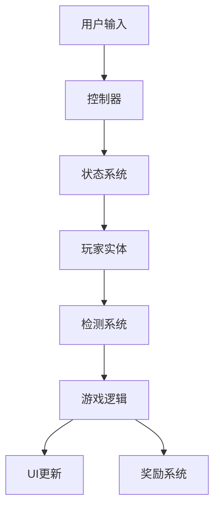
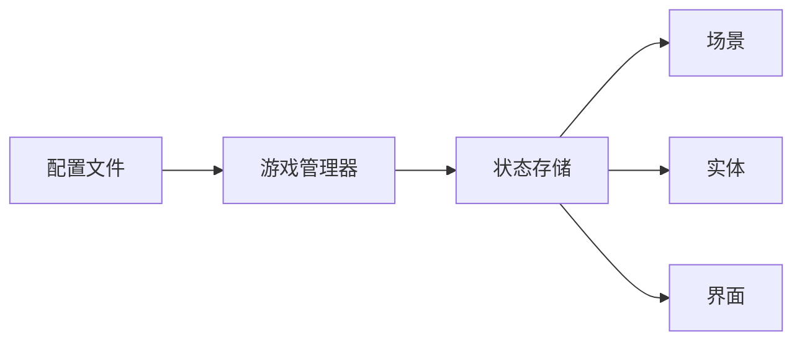

# 摸鱼特工 - 模块化架构设计

## 一、架构概览

### 技术栈选择
- **框架**: Next.js 15.4.6 (React 19)
- **游戏引擎**: Phaser 3.90.0
- **语言**: TypeScript 5.x
- **样式**: Tailwind CSS 4.x
- **状态管理**: Zustand (轻量级状态管理)
- **构建工具**: Next.js内置构建系统

### 架构原则
1. **模块解耦**: 各模块独立开发、测试
2. **数据驱动**: 配置与逻辑分离
3. **可扩展性**: 便于添加新关卡、新功能
4. **性能优先**: 优化渲染、减少重绘

## 二、核心模块划分

### 1. 游戏引擎模块 (GameEngine)
```
/src/game/
├── core/
│   ├── GameManager.ts      # 游戏主控制器
│   ├── SceneManager.ts      # 场景管理器
│   └── EventBus.ts          # 事件总线
├── config/
│   ├── gameConfig.ts        # 游戏配置
│   ├── levelConfig.ts       # 关卡配置
│   └── constants.ts         # 游戏常量
└── types/
    └── game.types.ts        # 类型定义
```

### 2. 场景模块 (Scenes)
```
/src/game/scenes/
├── BaseScene.ts            # 场景基类
├── PreloadScene.ts         # 资源加载
├── MainMenuScene.ts        # 主菜单
├── GameplayScene.ts        # 游戏主场景
├── PauseScene.ts           # 暂停场景
└── GameOverScene.ts        # 结束场景
```

### 3. 实体系统 (Entities)
```
/src/game/entities/
├── base/
│   ├── Entity.ts           # 实体基类
│   └── Component.ts        # 组件基类
├── player/
│   ├── Player.ts           # 玩家类
│   ├── PlayerStates.ts     # 状态机
│   └── PlayerController.ts # 控制器
└── inspector/
    ├── Inspector.ts        # 巡查员基类
    ├── InspectorTypes.ts   # 巡查员类型
    ├── PatrolSystem.ts     # 巡逻系统
    └── VisionCone.ts       # 视野锥系统
```

### 4. 地图系统 (Map)
```
/src/game/map/
├── MapGenerator.ts         # 地图生成器
├── WorkStation.ts          # 工位系统
├── PatrolRoute.ts          # 巡逻路线
└── MapConfig.ts            # 地图配置
```

### 5. UI系统 (UI)
```
/src/game/ui/
├── HUD/
│   ├── Timer.ts            # 计时器UI
│   ├── CoinCounter.ts      # 金币计数
│   ├── WorkProgress.ts     # 工作进度条
│   └── GoofProgress.ts     # 摸鱼进度条
├── Menus/
│   ├── MainMenu.ts         # 主菜单
│   ├── PauseMenu.ts        # 暂停菜单
│   └── SettingsMenu.ts     # 设置菜单
└── Dialogs/
    ├── GameOverDialog.ts   # 游戏结束弹窗
    └── AlertDialog.ts      # 警告弹窗
```

### 6. 游戏系统 (Systems)
```
/src/game/systems/
├── StateSystem.ts          # 状态管理系统
├── DetectionSystem.ts      # 检测系统
├── ProgressSystem.ts       # 进度系统
├── RewardSystem.ts         # 奖励系统
├── TimeSystem.ts           # 时间系统
└── SoundSystem.ts          # 音效系统
```

### 7. 小游戏模块 (MiniGames)
```
/src/game/minigames/
├── GoofOffGame.ts          # 摸鱼小游戏
├── ClickGame.ts            # 点击游戏
└── MiniGameManager.ts      # 小游戏管理器
```

### 8. 数据模块 (Data)
```
/src/game/data/
├── models/
│   ├── GameState.ts        # 游戏状态模型
│   ├── PlayerData.ts       # 玩家数据
│   └── LevelData.ts        # 关卡数据
├── store/
│   └── gameStore.ts        # Zustand存储
└── persistence/
    └── SaveManager.ts      # 存档管理
```

## 三、模块交互设计

### 事件流


### 数据流


## 四、关键技术实现

### 1. 视野锥检测算法
```typescript
interface VisionCone {
  angle: number;      // 视野角度
  distance: number;   // 视野距离
  rotation: number;   // 当前旋转角
  speed: number;      // 旋转速度
}

class VisionDetection {
  checkPlayerInCone(player: Player, inspector: Inspector): boolean {
    // 1. 计算玩家与巡查员的距离
    // 2. 计算玩家相对巡查员的角度
    // 3. 检查是否在视野锥范围内
    // 4. 考虑障碍物遮挡
  }
}
```

### 2. 状态机设计
```typescript
enum PlayerState {
  WORKING = 'working',
  GOOFING = 'goofing',
  CAUGHT = 'caught'
}

class StateMachine {
  private currentState: PlayerState;
  private transitions: Map<string, () => void>;
  
  transition(to: PlayerState): void {
    // 状态转换逻辑
  }
}
```

### 3. 时间映射系统
```typescript
class TimeSystem {
  private realTime: number = 300000;  // 5分钟
  private gameTime: number = 0;       // 游戏时间
  
  mapToGameTime(realMs: number): string {
    // 将实际时间映射为游戏时间 (9:00-19:00)
  }
}
```

## 五、性能优化策略

### 1. 渲染优化
- 使用对象池管理频繁创建的对象
- 实现视口剔除，只渲染可见区域
- 批量渲染相同类型的精灵

### 2. 碰撞检测优化
- 使用四叉树空间划分
- 分层检测（粗检测 + 精检测）
- 缓存检测结果

### 3. 资源管理
- 按需加载资源
- 纹理图集优化
- 音频精灵表

## 六、开发路线图

### Phase 1: 基础框架 (Sprint 1)
- [x] 项目初始化
- [ ] 游戏引擎集成
- [ ] 基础场景系统
- [ ] 配置管理系统

### Phase 2: 核心玩法 (Sprint 2)
- [ ] 玩家实体与控制
- [ ] 状态机实现
- [ ] 基础UI系统
- [ ] 时间系统

### Phase 3: AI系统 (Sprint 3)
- [ ] 巡查员实体
- [ ] 巡逻路径系统
- [ ] 视野锥检测
- [ ] AI行为树

### Phase 4: 游戏机制 (Sprint 4)
- [ ] 进度条系统
- [ ] 摸鱼小游戏
- [ ] 奖励系统
- [ ] 失败判定

### Phase 5: 完善优化 (Sprint 5)
- [ ] 音效系统
- [ ] 动画效果
- [ ] 性能优化
- [ ] 移动端适配

## 七、接口定义

### GameConfig接口
```typescript
interface GameConfig {
  screen: {
    width: number;
    height: number;
    scale: ScaleMode;
  };
  gameplay: {
    totalTime: number;      // 总时长
    maxWorkTime: number;    // 最大工作时间
    targetCoins: number;    // 目标金币
  };
  difficulty: {
    inspectorCount: number;
    inspectorSpeed: number;
    detectionRange: number;
  };
}
```

### LevelData接口
```typescript
interface LevelData {
  id: string;
  name: string;
  map: MapConfig;
  inspectors: InspectorConfig[];
  objectives: Objective[];
  rewards: Reward[];
}
```

## 八、错误处理与调试

### 错误边界
- React错误边界捕获组件错误
- Phaser错误处理机制
- 全局错误监控

### 调试工具
- Redux DevTools (状态调试)
- Phaser Debug Mode (物理调试)
- Performance Monitor (性能监控)

## 九、测试策略

### 单元测试
- 游戏逻辑测试
- 算法测试
- 工具函数测试

### 集成测试
- 场景切换测试
- 系统交互测试
- 数据流测试

### E2E测试
- 完整游戏流程测试
- 用户交互测试
- 性能基准测试